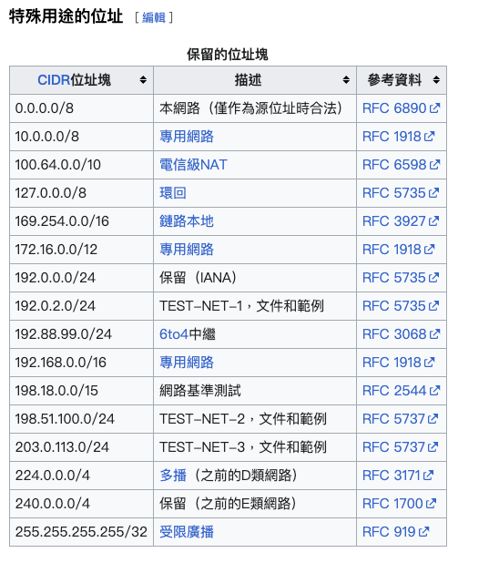
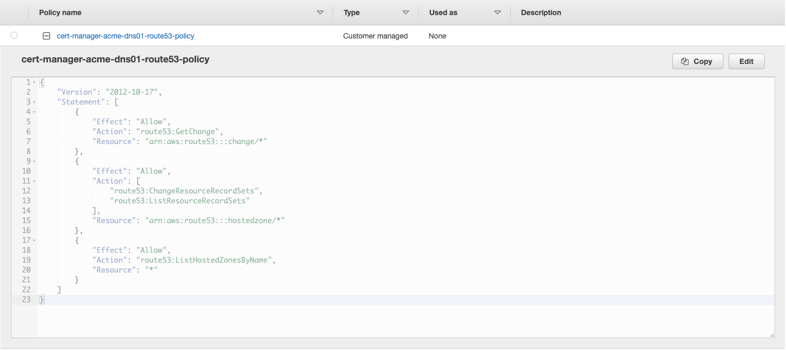
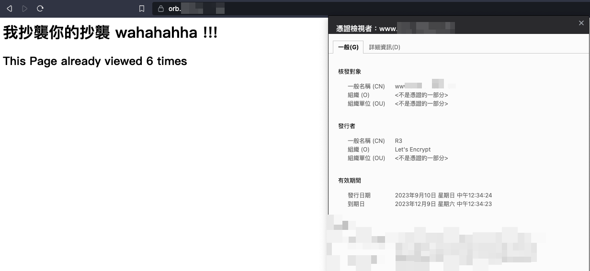

# HL Homework

### Build Go application
```bash
go build -o app
```

### Build image
```
docker build -t go-app .
```


### Use exist image from github container registry
```bash
docker pull ghcr.io/neilkuan/hlhomework:amd64

docker run -d -p 8080:8080 ghcr.io/neilkuan/hlhomework:amd64
```


## Install nginx-ingress-controller for Orbstack (Only for macOS now) Kubernetes feature
- Orbstack Kubernetes feature
- Kubernetes version 1.27+

> If you don't have Helm or if you prefer to use a YAML manifest, you can run the following command instead:
```bash
kubectl apply -f https://raw.githubusercontent.com/kubernetes/ingress-nginx/controller-v1.8.2/deploy/static/provider/cloud/deploy.yaml
```

> Check Events 
```bash
kubectl -n ingress-nginx get event

...
18s         Normal   UpdatedLoadBalancer    service/ingress-nginx-controller                 Updated LoadBalancer with new IPs: [] -> [198.x.x.x]
2s          Normal   Pulled                 pod/ingress-nginx-controller-5dcc7dbd55-dt8ql    Successfully pulled image "registry.k8s.io/ingress-nginx/controller:v1.8.2@sha256:74834d3d25b336b62cabeb8bf7f1d788706e2cf1cfd64022de4137ade8881ff2" in 49.134762613s (49.134768821s including waiting)
...
``` 

> For me nginx-ingress-controller was bounding default LoadBalancer with my local bridge 
> inet 198.19.249.3 netmask 0xffffff00 broadcast 198.19.249.255


```bash
kubectl -n ingress-nginx get svc
NAME                                 TYPE           CLUSTER-IP        EXTERNAL-IP    PORT(S)                      AGE
ingress-nginx-controller-admission   ClusterIP      192.168.194.168   <none>         443/TCP                      2m35s
ingress-nginx-controller             LoadBalancer   192.168.194.175   198.19.249.2   80:32745/TCP,443:32060/TCP   2m35s
```

## [Securing NGINX-ingress](https://cert-manager.io/docs/tutorials/acme/nginx-ingress/)

### Step 3 - Assign a DNS name
The external IP that is allocated to the ingress-controller is the IP to which all incoming traffic should be routed. To enable this, add it to a DNS zone you control, for example as www.example.com.

This quick-start assumes you know how to assign a DNS entry to an IP address and will do so.

```bash
k get svc -n ingress-nginx
NAME                                 TYPE           CLUSTER-IP        EXTERNAL-IP    PORT(S)                      AGE
ingress-nginx-controller-admission   ClusterIP      192.168.194.168   <none>         443/TCP                      17m
ingress-nginx-controller             LoadBalancer   192.168.194.175   198.19.249.2   80:32745/TCP,443:32060/TCP   17m
```
In My Case, let 198.19.249.2 ARecord to www.example.com

### Step 4 - Deploy an Example Service
```bash
kubectl apply -f ./k8s/orbstack/deployment.yaml
kubectl apply -f ./k8s/orbstack/service.yaml

kubectl get pod,svc 
NAME                              READY   STATUS    RESTARTS   AGE
pod/hlhomework-5b6bcf8987-7qh2z   1/1     Running   0          28s

NAME                 TYPE        CLUSTER-IP        EXTERNAL-IP   PORT(S)    AGE
service/kubernetes   ClusterIP   192.168.194.129   <none>        443/TCP    10d
service/hlhomework   ClusterIP   192.168.194.150   <none>        8080/TCP   24s
```

A sample ingress you can start with is:
```bash
echo '
apiVersion: "networking.k8s.io/v1"
kind: "Ingress"
metadata:
  name: "hlhomework"
spec:
  ingressClassName: nginx
  rules: 
    - http: 
        paths:       
        - path: "/"
          pathType: "Prefix"
          backend: 
            service: 
              name: hlhomework
              port: 
                number: 8080' | kubectl apply -f -

kubectl get ing
NAME         CLASS   HOSTS  ADDRESS        PORTS   AGE
hlhomework   nginx   none   198.19.249.2   80      23s
```

Check the unsecuring url 
```bash
curl -kivL http://198.19.249.2                      

*   Trying 198.19.249.2:80...
* Connected to 198.19.249.2 port 80 (#0)
> GET / HTTP/1.1
> User-Agent: curl/8.1.2
> Accept: */*
> 
< HTTP/1.1 200 OK
HTTP/1.1 200 OK
< Date: Sun, 10 Sep 2023 03:01:50 GMT
Date: Sun, 10 Sep 2023 03:01:50 GMT
< Content-Type: text/html; charset=utf-8
Content-Type: text/html; charset=utf-8
< Content-Length: 151
Content-Length: 151
< Connection: keep-alive
Connection: keep-alive

< 

<html> 
<head> 
    <title>4</title>
</body>
          <h1> 我抄襲你的抄襲 wahahahha !!! </h1>
    <h2> This Page already viewed 4 times</h2>
</html>
* Connection #0 to host 198.19.249.2 left intact
```


### Step 5 - Deploy cert-manager
We need to install cert-manager to do the work with Kubernetes to request a certificate and respond to the challenge to validate it. We can use Helm or plain Kubernetes manifests to install cert-manager.

Since we installed Helm earlier, we'll assume you want to use Helm; follow the Helm guide. For other methods, read the [installation documentation](https://cert-manager.io/docs/installation/) for cert-manager.

cert-manager mainly uses two different custom Kubernetes resources - known as CRDs - to configure and control how it operates, as well as to store state. These resources are Issuers and Certificates.
```bash
kubectl apply -f https://github.com/cert-manager/cert-manager/releases/download/v1.12.4/cert-manager.yaml

kubectl -n cert-manager get all
NAME                                           READY   STATUS    RESTARTS   AGE
pod/cert-manager-cainjector-6984b7b788-hhft7   1/1     Running   0          27s
pod/cert-manager-6884d8f5db-fq9k9              1/1     Running   0          27s
pod/cert-manager-webhook-5569b5c986-4thv7      1/1     Running   0          27s

NAME                           TYPE        CLUSTER-IP        EXTERNAL-IP   PORT(S)    AGE
service/cert-manager           ClusterIP   192.168.194.146   <none>        9402/TCP   27s
service/cert-manager-webhook   ClusterIP   192.168.194.204   <none>        443/TCP    27s

NAME                                      READY   UP-TO-DATE   AVAILABLE   AGE
deployment.apps/cert-manager-cainjector   1/1     1            1           27s
deployment.apps/cert-manager              1/1     1            1           27s
deployment.apps/cert-manager-webhook      1/1     1            1           27s

NAME                                                 DESIRED   CURRENT   READY   AGE
replicaset.apps/cert-manager-cainjector-6984b7b788   1         1         1       27s
replicaset.apps/cert-manager-6884d8f5db              1         1         1       27s
replicaset.apps/cert-manager-webhook-5569b5c986      1         1         1       27s
```


#### Issuers
An Issuer defines how cert-manager will request TLS certificates. Issuers are specific to a single namespace in Kubernetes, but there's also a `ClusterIssuer` which is meant to be a cluster-wide version.

Take care to ensure that your `Issuers` are created in the same namespace as the certificates you want to create. You might need to add `-n my-namespace` to your `kubectl create` commands.

Your other option is to replace your `Issuers` with `ClusterIssuers`; `ClusterIssuer` resources apply across all Ingress resources in your cluster. If using a `ClusterIssuer`, remember to update the Ingress annotation `cert-manager.io/issuer` to `cert-manager.io/cluster-issuer`.

If you see issues with issuers, follow the Troubleshooting Issuing ACME Certificates guide.

More information on the differences between `Issuers` and `ClusterIssuers` - including when you might choose to use each can be found on Issuer concepts.


####  Certificates
Certificates resources allow you to specify the details of the certificate you want to request. They reference an issuer to define how they'll be issued.

For more information, see Certificate concepts.


### Step 6 - Configure a Let's Encrypt Issuer
We'll set up two issuers for Let's Encrypt in this example: staging and production.

The Let's Encrypt production issuer has very strict [rate limits](https://letsencrypt.org/docs/rate-limits/). When you're experimenting and learning, it can be very easy to hit those limits. Because of that risk, we'll start with the Let's Encrypt staging issuer, and once we're happy that it's working we'll switch to the production issuer.

Note that you'll see a warning about untrusted certificates from the staging issuer, but that's totally expected.

Create this definition locally and update the email address to your own. This email is required by Let's Encrypt and used to notify you of certificate expiration and updates.

For Local Lab, But I use Issuing an ACME certificate using DNS validation.
> Use Route53 as DNS01 Challenge Provider 
source: https://cert-manager.io/docs/configuration/acme/dns01/route53/

#### Set Up an IAM Role
cert-manager needs to be able to add records to Route53 in order to solve the DNS01 challenge. To enable this, create a IAM policy with the following permissions:

```bash
{
  "Version": "2012-10-17",
  "Statement": [
    {
      "Effect": "Allow",
      "Action": "route53:GetChange",
      "Resource": "arn:aws:route53:::change/*"
    },
    {
      "Effect": "Allow",
      "Action": [
        "route53:ChangeResourceRecordSets",
        "route53:ListResourceRecordSets"
      ],
      "Resource": "arn:aws:route53:::hostedzone/*"
    },
    {
      "Effect": "Allow",
      "Action": "route53:ListHostedZonesByName",
      "Resource": "*"
    }
  ]
}
```

> Note: The route53:ListHostedZonesByName statement can be removed if you specify the (optional) hostedZoneID. You can further tighten the policy by limiting the hosted zone that cert-manager has access to (e.g. arn:aws:route53:::hostedzone/DIKER8JEXAMPLE).


#### Credentials For IAM User
This Part I created IAM user attach policy that we just created.
And create AK/SK for it 

Create Secret to store AK/SK.
🚨🚨🚨 Please Replace `YOUR_ACCESS_KEY_ID_SECRET` 🚨🚨🚨 to yours.
```bash
kubectl create secret generic prod-route53-credentials-secret --from-literal=secret-access-key=YOUR_ACCESS_KEY_ID_SECRET
secret/prod-route53-credentials-secret created
```

🚨🚨🚨 Please Replace `user@example.com` and `YOUR_ACCESS_KEY_ID` 🚨🚨🚨 to yours.
```bash
echo '
apiVersion: cert-manager.io/v1
kind: Issuer
metadata:
  name: letsencrypt-prod
spec:
  acme:
    server: https://acme-v02.api.letsencrypt.org/directory
    email: user@example.com
    privateKeySecretRef:
      name: letsencrypt-prod
    solvers:
    - selector: {}
      dns01:
        route53:
          region: us-east-1
          accessKeyID: YOUR_ACCESS_KEY_ID
          secretAccessKeySecretRef:
            name: prod-route53-credentials-secret
            key: secret-access-key' | kubectl apply -f -
```

Check the `Issuer`
```bash
kubectl get issuers                                            
NAME               READY   AGE
letsencrypt-prod   True    11s
```

### Step 7 - Deploy a TLS Ingress Resource
🚨🚨🚨 Please Replace `YOUR_DOMAIN` aka `www.example.com` 🚨🚨🚨 to yours.
```bash
echo '
apiVersion: "networking.k8s.io/v1"
kind: "Ingress"
metadata:
  name: "hlhomework"
  annotations:
    cert-manager.io/issuer: "letsencrypt-prod"
spec:
  ingressClassName: nginx
  tls:
  - hosts:
    - "YOUR_DOMAIN"
    secretName: hlhomework-tls
  rules: 
    - host: YOUR_DOMAIN
      http: 
        paths:       
        - path: "/"
          pathType: "Prefix"
          backend: 
            service: 
              name: hlhomework
              port: 
                number: 8080' | kubectl apply -f -
```
