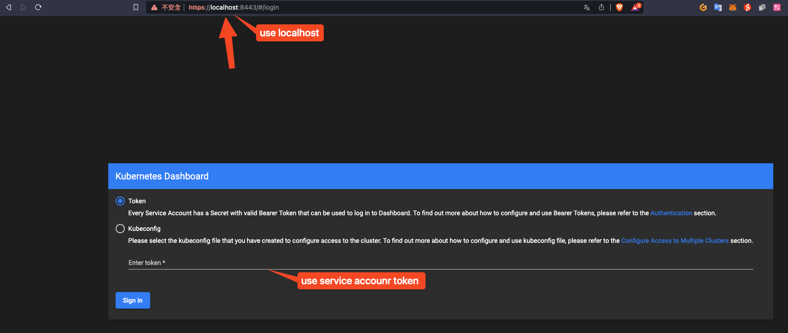
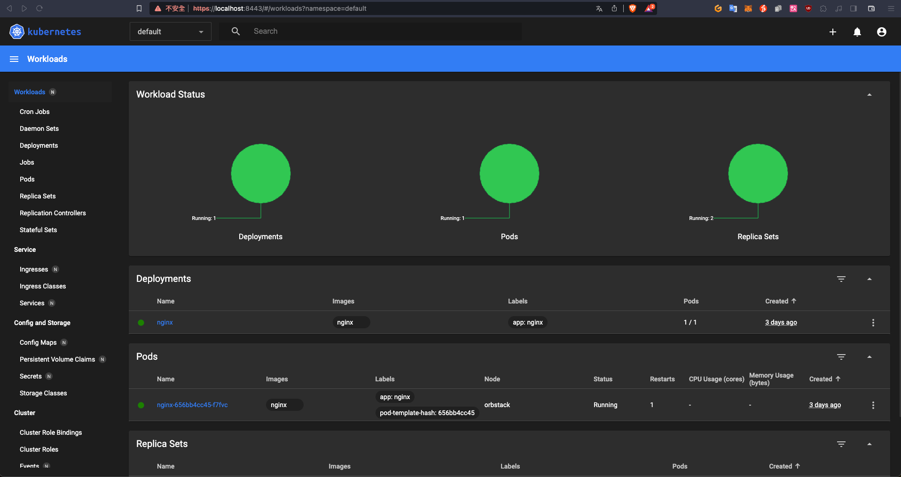

# Dashboard v3 install

```bash
kubectl apply -f https://raw.githubusercontent.com/kubernetes/ingress-nginx/controller-v1.8.2/deploy/static/provider/cloud/deploy.yaml
sleep 30
kubectl -n ingress-nginx get all
sleep 30
kubectl apply -f https://github.com/cert-manager/cert-manager/releases/download/v1.12.4/cert-manager.yaml
sleep 30
kubectl -n cert-manager get all
sleep 30
kubectl apply -f https://raw.githubusercontent.com/kubernetes/dashboard/v3.0.0-alpha0/charts/kubernetes-dashboard.yaml
sleep 30


echo "Create service account binding cluster-admin ClusterRole to login Dashboard"
echo '
---
apiVersion: v1
kind: ServiceAccount
metadata:
  name: kubernetes-dashboard-admin
  namespace: kubernetes-dashboard
---
apiVersion: rbac.authorization.k8s.io/v1
kind: ClusterRoleBinding
metadata:
  name: kubernetes-dashboard-admin
  namespace: kubernetes-dashboard
roleRef:
  apiGroup: rbac.authorization.k8s.io
  kind: ClusterRole
  name: cluster-admin
subjects:
  - kind: ServiceAccount
    name: kubernetes-dashboard-admin
    namespace: kubernetes-dashboard
' | kubectl apply -f -
```

## Create token for service account
```bash
kubectl create token kubernetes-dashboard -n kubernetes-dashboard                
eyJhbGciOiJxxxxxxxxx.xxxxxxxxx.xxxxxx
```

## Connect to Dashboard
```bash
kubectl -n ingress-nginx  port-forward svc/ingress-nginx-controller 8443:443
```


